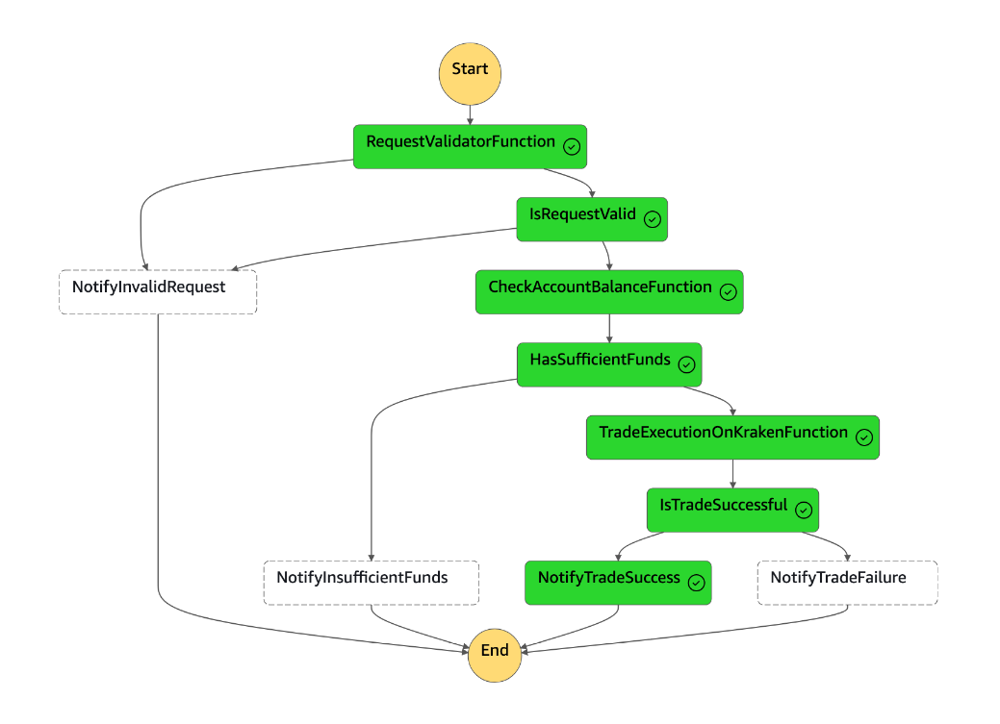
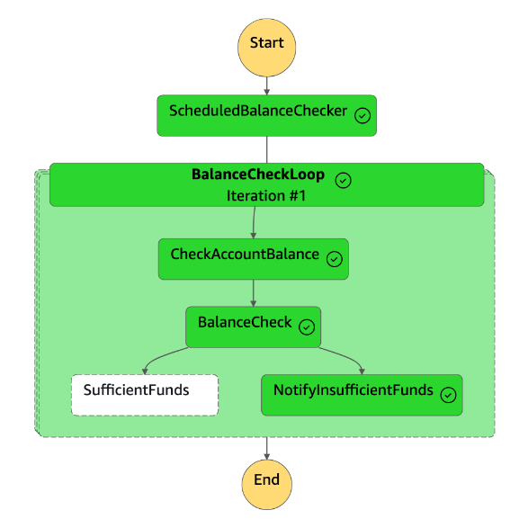

# Smart DCA Trade Bot

This is a crypto trading bot designed to work in conjunction with a DCA style trading strategy. An amount of quote currency is specified in 
the request and the bot will purchase that value of the base asset based on current market value. 

The bot also incorporates a scheduled quote currency checker to alert the user when the free value of quote currency assets are running low 
on the exchange.

The bot uses state machines to configure the logic flows for each of these tasks.

## Execute Trade

The logic flow to execute a trade follows the pattern:
- Authenticate incoming request. A valid `api_key` must be provided as a query parameter
- Validate request body
- Check exchange has enough of quote currency to allow the trade to be executed for the requested amount
- Execute the trade on the exchange
- Notify the user by email if the trade got executed successfully

As an example, the following request will attempt to purchase 100 USD worth of BTC using the free USD balance on the exchange:

```json
{
  "baseCurrency": "BTC",
  "quoteCurrency": "USD",
  "quoteAmount": 100,
  "isTestnet": false
}
```

### State Machine

Below is an example of the state machine logic flow for a successfully placed trade:



## Scheduled Balance Checker

The logic flow to periodically check the balance of quote currency on the exchange follows this pattern:
- Balance checker Lambda triggered on a schedule
- Balance checker Lambda pulls in list of currencies and amounts to be checked
- For each currency:
  - Check balance of currency on exchange is greater than amount threshold
  - If not, trigger an email to the user prompting them to top up the balance of the quote currency

### State Machine

Below is an example of the state machine logic flow for a scheduled check which found the quote currency balance to be below the required threshold



## Configuration

All config is stored using AWS Parameter Store. The following parameters must be set to run the bot:
- Name: `/SmartDcaTradeBot/Live/KrakenAuthentication/apiKey` | Type: SecureString | Value: API key generated on Live Kraken exchange
- Name: `/SmartDcaTradeBot/Live/KrakenAuthentication/privateKey` | Type: SecureString | Value: API key generated on Live Kraken exchange
- Name: `/SmartDcaTradeBot/Live/Authentication/apiKey` | Type: SecureString | Value: API key used to authenticate requests to this bot
- Name: `/SmartDcaTradeBot/Live/Authentication/whitelistIPs` | Type: StringList | Value: Comma separated list of strings defining whitelisted IPs
  - All IP addresses specified in [TradingView's webhook documentation](https://www.tradingview.com/support/solutions/43000529348-about-webhooks/) must be added
  - IPs should be separated with commas with no quotes or spaces, e.g. `52.89.214.238,34.212.75.30`
- Name: `/SmartDcaTradeBot/Live/Notifications/recipientEmailAddresses` | Type: StringList | Value: Comma separated list of email addresses to send notifications to
- Name: `/SmartDcaTradeBot/Live/Notifications/senderEmailAddress` | Type: String | Value: Email address notification emails are sent from
- Name: `/SmartDcaTradeBot/Live/ScheduledBalanceChecker/input` | Type: String | Value: Config defining currencies and thresholds to be checked by Scheduled Balance Checker
  - Formatted as a list of dictionaries, e.g. `[{"currency": "USD", "amount": 165}, {"currency": "USDT", "amount": 200}]`
- Name: `/SmartDcaTradeBot/Demo/KrakenAuthentication/apiKey` | Type: SecureString | Value: API key generated on Demo Kraken Futures exchange
- Name: `/SmartDcaTradeBot/Demo/KrakenAuthentication/privateKey` | Type: SecureString | Value: API key generated on Demo Kraken Futures exchange

## Deployment

Set all configuration values required from the list above.

From the project directory where `template.yaml` is located, execute:

```zsh
./deploy.sh
```
This will execute the full process of installing dependencies in the dependency layer, packaging all resources and deploying to AWS.

During development it is useful to have changes constantly pushed to AWS. For this use:

```zsh
sam sync
```

## Supported Exchanges

Currently, the bot is only set up to work on the Kraken exchange, but it uses the CCXT library to interact with exchanges so it should be 
easy to extend this to more exchanges in future should the need arise. 

## Testing

To allow testing of the trade bot without the need to place real orders on a live exchange, there is the ability to run it in test mode.

Unfortunately not every exchange offers a testnet exchange. Kraken offers one for Kraken Futures but not Kraken Spot. 
So currently when running in testnet mode it will be placing trades on the Kraken Futures Demo exchange.

To enable execution of trades against the testnet exchange, set the value of `isTestnet` to `true` in the trade request.

For instructions on how to create a demo account on Kraken Futures, visit [this page](https://support.kraken.com/hc/en-us/articles/360026192132-Futures-Demo-Test-accounts)